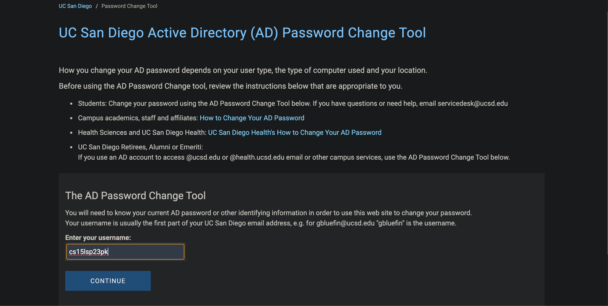

# Lab Report 1

### Part 1: Installing Visual Studio Code
(If you use a different integrated development environment similar to Visual Studio code or are unable to install it, you can skip this step and move on to the next Part)

To install Visual Studio Code you want to go to there [website](https://code.visualstudio.com/Download) and download whatever operating system your computer is running on (Windows, Mac, Linux, etc) and install Visual Studio Code. 

Next you want to open up VS code and take a screenshot of what you see. It should look something similar to this:

### Part 2: Remote Access

If you are on Mac, you can skip this steep. If you are running on Windows, this will be your first step. You will need to install [git](https://gitforwindows.org/). After this you will need to set up your default terminal to git bash in vscode. [Turtorial on how to do that](https://stackoverflow.com/questions/42606837/how-do-i-use-bash-on-windows-from-the-visual-studio-code-integrated-terminal/50527994#50527994) 

The next step is setting up your cse15l account, so that you can access the server. To do this you want to head over to this [tutorial](https://docs.google.com/document/d/1hs7CyQeh-MdUfM9uv99i8tqfneos6Y8bDU0uhn1wqho/edit) on how to do this. However, since this a bit out of date, you will need to go through steps 1-5

Step 6:

Enter the username that you were given and then hit continue. 

After this it will ask you to confirm on your duo mobile and after that it will give you a link to change your password that will be sent to your email. 

